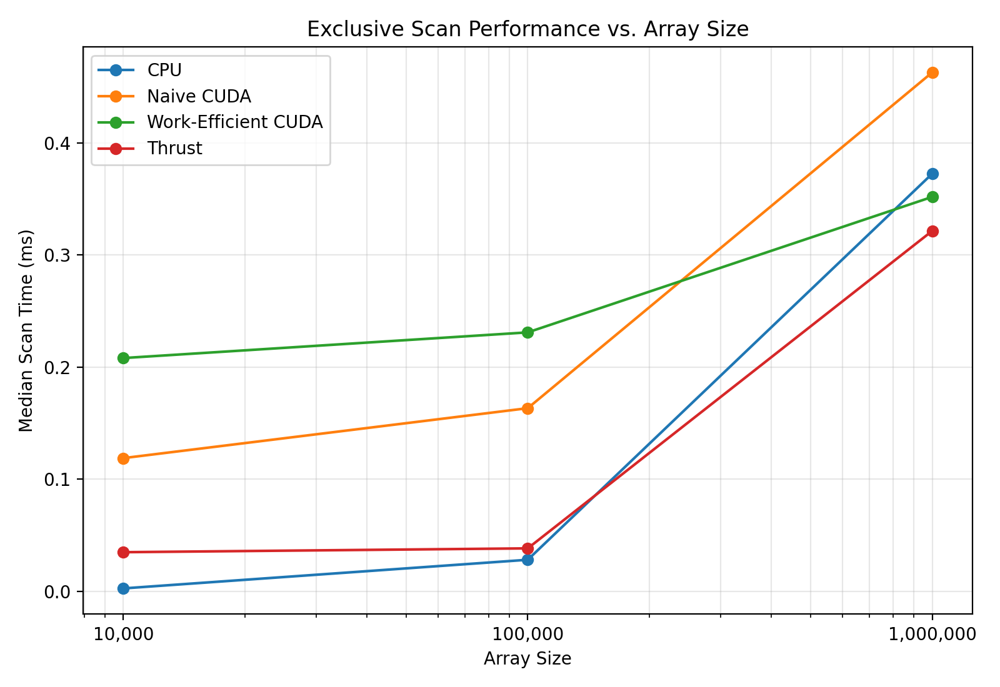
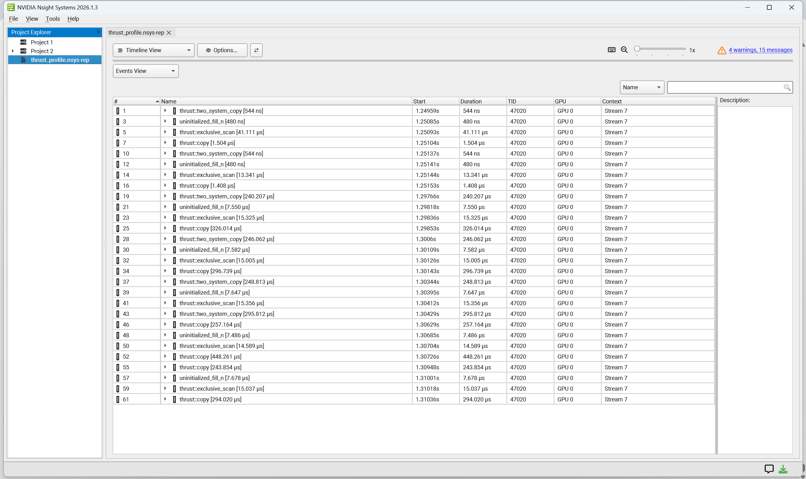
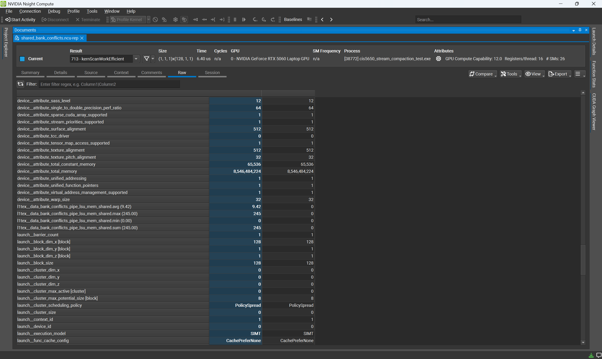

CUDA Stream Compaction
======================

**University of Pennsylvania, CIS 565: GPU Programming and Architecture, Project 2**

* Ethan Yang
  * [GitHub](https://github.com/eyang72004)
* Tested on: Windows 11 (Personal Laptop), Intel(R) Core(TM) Ultra 9 275HX, 32 GB RAM, NVIDIA GeForce RTX 5060 Laptop GPU


## Implementation


This project implements several versions of exclusive prefix-sum scan and stream compaction on the CPU and GPU. I implemented a serial CPU scan, a naive CUDA scan, a work-efficient CUDA scan, stream compaction, and a Thrust scan for comparison. For extra credit, I also implemented radix sort using my work-efficient scan and shared-memory versions of the naive and work-efficient scans, including a version designed to reduce shared-memory bank conflicts.


### CPU

I implemented the CPU scan as a serial exclusive prefix sum. I also implemented two CPU versions of stream compaction: one that directly copies nonzero elements into the output array, and one that maps the input to booleans, performs an exclusive scan, and scatters the nonzero elements to their new indices.


### Naive GPU Scan

I implemented the naive CUDA scan using the iterative scan approach from the course material. Each iteration uses an offset that doubles from the previous iteration, and I use two device buffers that swap after each kernel launch so that threads do not read values that are being updated during the same iteration. The resulting inclusive scan is then shifted by one element to produce the required exclusive scan.


### Work-Efficient GPU Scan

I implemented the work-efficient scan using the up-sweep and down-sweep approach from the course material and GPU Gems Chapter 39. Since this algorithm operates on a power-of-two-sized tree, I round the working array size up to the next power of two and pad the remaining entries with zeros. I also reduce the number of threads and blocks launched at deeper levels of the tree as the amount of active work decreases.


### GPU Stream Compaction

I implemented GPU stream compaction by first mapping each input element to 1 if it is nonzero and 0 otherwise. I then use my work-efficient exclusive scan to compute the destination indices and scatter the nonzero input elements into the output array.


### Thrust Scan

For comparison, I implemented an exclusive scan using `thrust::exclusive_scan`. I copy the input into a `thrust::device_vector`, perform the scan on the GPU, and copy the result back to the host. For performance measurements, I time only the `thrust::exclusive_scan` call so that the initial and final memory operations are excluded from the measured scan time.


### Extra Credit: Radix Sort

I implemented a GPU radix sort for nonnegative integers using my work-efficient scan. For each bit from least significant to most significant, I map each element based on the current bit and perform an exclusive scan over the elements whose bit is 0. I use the scan results to place the 0-bit elements first and the 1-bit elements after them, then scatter the input into the resulting positions. I repeat this process for all 32 bits while swapping between two device buffers after each pass.


### Extra Credit: Shared-Memory Scan

I also implemented shared-memory versions of the naive and work-efficient scans based on GPU Gems Chapter 39. The work-efficient version uses the up-sweep and down-sweep procedure within a single block. I then implemented a bank-conflict-reduced version that changes the shared-memory indexing and adds padding based on a 32-bank shared-memory layout. I used Nsight Compute to compare the shared-memory bank conflicts between the baseline and padded work-efficient implementations.


## Performance Analysis

I performed all performance testing using the Release build on the system listed above. For the scan benchmarks, I excluded initial and final memory allocation and transfer operations from the measured GPU execution time. Since I observed noticeable run-to-run timing variation, I used repeated trials rather than relying on a single measurement.


### Block Size Optimization

Before collecting the final scaling results, I tested several CUDA block sizes for the naive and work-efficient scans using an input size of 1,000,000 elements. For each block size, the program averaged 5 benchmark trials, and I repeated the program 5 times. Because the individual runs showed noticeable timing variation, I used the median of the 5 run averages to compare block sizes.


| Block Size | Naive Scan (ms) | Work-Efficient Scan (ms) |
|-----------:|----------------:|-------------------------:|
| 64         | 1.105965        | 0.365830                 |
| 128        | 2.566445        | 0.432582                 |
| 256        | 2.278637        | 0.407616                 |
| 512        | 2.455834        | 0.765427                 |
| 1024       | 3.048743        | 0.628090                 |


For both implementations, a block size of 64 produced the lowest median execution time, so I used 64 threads per block for the final naive and work-efficient scan benchmarks. Increasing the block size did not consistently improve performance. The work-efficient scan was faster than the naive scan for every block size I tested, although the exact timings varied between runs.


### Scan Performance


I compared the serial CPU, naive CUDA, work-efficient CUDA, and Thrust scans at array sizes of 10,000, 100,000, and 1,000,000 elements. For each array size, the program averaged 5 benchmark trials, and I repeated the program 5 times. I report the median of the 5 run averages below to reduce the effect of the run-to-run timing variation I observed.


| Array Size | Serial CPU (ms) | Naive CUDA (ms) | Work-Efficient CUDA (ms) | Thrust (ms) |
|-----------:|----------------:|----------------:|-------------------------:|------------:|
| 10,000     | 0.002540        | 0.118816        | 0.208115                 | 0.034854    |
| 100,000    | 0.028100        | 0.163386        | 0.231034                 | 0.038278    |
| 1,000,000  | 0.372620        | 0.463027        | 0.351942                 | 0.321581    |





At 10,000 and 100,000 elements, the serial CPU scan was faster than all three GPU scan implementations. At these smaller sizes, the amount of parallel work is relatively limited, while GPU execution still incurs kernel-launch and synchronization overhead. My work-efficient scan was also slower than the naive scan at these two sizes. The naive scan performs a separate global-memory scan step for each doubling offset, so its repeated kernel launches and memory accesses become increasingly expensive as the input size grows. Although the work-efficient algorithm performs less total work, the additional setup, power-of-two padding, and up-sweep and down-sweep kernel launches still introduce overhead that is significant for smaller inputs. At 1,000,000 elements, the reduced work becomes more beneficial, and the work-efficient CUDA scan became faster than both the naive scan and the serial CPU scan, taking 0.351942 ms compared with 0.463027 ms and 0.372620 ms, respectively. Thrust was the fastest at this size at 0.321581 ms.


### Thrust Profiling





The Nsight Systems timeline shows that the `thrust::exclusive_scan` call is surrounded by other Thrust operations, including copy and initialization work. For the performance comparison above, I timed only the `thrust::exclusive_scan` call so that the surrounding memory operations were excluded from the scan timing. The timeline also shows that the scan itself is only one part of the overall Thrust wrapper activity.


### Extra Credit: Work-Efficient Scan Optimization

For the work-efficient scan, I reduced the amount of inactive work at deeper levels of the up-sweep and down-sweep. In the straightforward implementation, the same grid size can be launched at every level even though the number of elements that actually participate decreases as the tree moves toward the root. This means that many launched threads have no useful work at the deeper levels of the scan. Instead, I calculate the amount of active work at each level and launch only the number of blocks needed for those elements. This reduces unnecessary thread and block launches as the amount of active work decreases. I did not separately benchmark the optimized and unoptimized versions, so I do not claim a measured speedup from this change alone.


### Extra Credit: Radix Sort


I implemented radix sort using my work-efficient scan as the scan operation for each bitwise split. The sort can be called with an output array, an input array, and the number of elements:

```cpp
StreamCompaction::Radix::sort(n, output, input);
```


For example, an input such as `[7, 2, 5, 2, 1]` produces the sorted output `[1, 2, 2, 5, 7]`.


### Extra Credit: Shared-Memory Scan


I compared the baseline work-efficient shared-memory scan against my padded version using Nsight Compute. For the profiled kernel, Nsight Compute reported 245 shared-memory bank conflicts for the baseline version and 0 for the padded version. The padded version uses slightly more shared memory because of the added padding, but it eliminated the measured bank conflicts for this test.





## Testing

I tested the CPU, naive CUDA, work-efficient CUDA, and Thrust implementations on both power-of-two and non-power-of-two input sizes. The shared-memory scan implementations were tested on power-of-two inputs. In addition to the provided scan and compaction checks, I added tests for the shared-memory scans and radix sort, including power-of-two, non-power-of-two, and duplicate-value radix-sort cases.

```text
****************
** SCAN TESTS **
****************
    [   6   9  44   4  30  17   9  13  23   4   1  48   8 ...  21   0 ]
==== cpu scan, power-of-two ====
   elapsed time: 0.0002ms    (std::chrono Measured)
    [   0   6  15  59  63  93 110 119 132 155 159 160 208 ... 6073 6094 ]
==== cpu scan, non-power-of-two ====
   elapsed time: 0.0001ms    (std::chrono Measured)
    [   0   6  15  59  63  93 110 119 132 155 159 160 208 ... 5992 6021 ]
    passed
==== naive scan, power-of-two ====
   elapsed time: 0.122912ms    (CUDA Measured)
    passed
==== naive scan, non-power-of-two ====
   elapsed time: 0.055136ms    (CUDA Measured)
    passed
==== shared naive scan, power-of-two ====
   elapsed time: 0.031072ms    (CUDA Measured)
    passed
==== shared work-efficient scan, power-of-two ====
   elapsed time: 0.027776ms    (CUDA Measured)
    passed
==== work-efficient scan, power-of-two ====
   elapsed time: 0.269312ms    (CUDA Measured)
    passed
==== work-efficient scan, non-power-of-two ====
   elapsed time: 0.137664ms    (CUDA Measured)
    passed
==== shared work-efficient bank-conflict-free scan, power-of-two ====
   elapsed time: 0.023392ms    (CUDA Measured)
    passed
==== thrust scan, power-of-two ====
   elapsed time: 0.117376ms    (CUDA Measured)
    passed
==== thrust scan, non-power-of-two ====
   elapsed time: 0.03312ms    (CUDA Measured)
    passed

*****************************
** STREAM COMPACTION TESTS **
*****************************
    [   2   1   0   0   0   3   3   3   3   0   3   2   0 ...   1   0 ]
==== cpu compact without scan, power-of-two ====
   elapsed time: 0.001ms    (std::chrono Measured)
    [   2   1   3   3   3   3   3   2   1   1   1   3   2 ...   1   1 ]
    passed
==== cpu compact without scan, non-power-of-two ====
   elapsed time: 0.0005ms    (std::chrono Measured)
    [   2   1   3   3   3   3   3   2   1   1   1   3   2 ...   1   3 ]
    passed
==== cpu compact with scan ====
   elapsed time: 0.0048ms    (std::chrono Measured)
    [   2   1   3   3   3   3   3   2   1   1   1   3   2 ...   1   1 ]
    passed
==== work-efficient compact, power-of-two ====
   elapsed time: 0.2656ms    (CUDA Measured)
    passed
==== work-efficient compact, non-power-of-two ====
   elapsed time: 0.15632ms    (CUDA Measured)
    passed

**********************
** RADIX SORT TESTS **
**********************
==== radix sort, power-of-two ====
    passed
==== radix sort, non-power-of-two ====
    passed
==== radix sort, duplicates ====
    passed

************************
** SCAN PERFORMANCE **
************************
==== benchmark cpu scan ====
   average elapsed time: 0.360360ms
==== benchmark naive scan ====
   average elapsed time: 0.462470ms
==== benchmark work-efficient scan ====
   average elapsed time: 0.339834ms
==== benchmark thrust scan ====
   average elapsed time: 0.358637ms
Press any key to continue . . .
```

## Build Instructions

I built and tested the project on Windows 11 using CMake, Visual Studio 2026 Community, and CUDA 13.3.


To build the Release configuration from the project root:

```bat
cmake --build out\build\x64-Release
```


To run the test program:

```bat
out\build\x64-Release\bin\cis5650_stream_compaction_test.exe
```