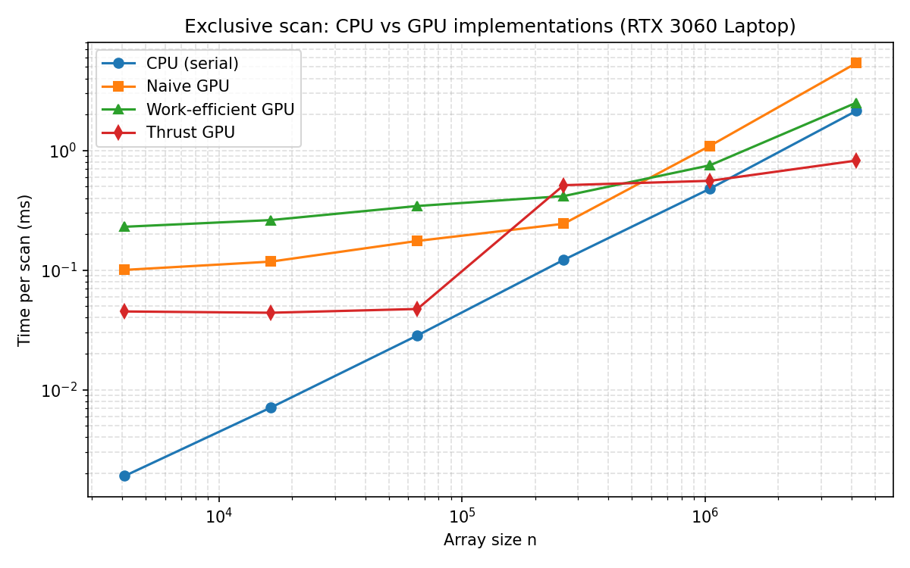

# CUDA Stream Compaction

**University of Pennsylvania, CIS 5650: GPU Programming and Architecture,
Project 2 - Stream Compaction**

* **Jing Huang**
  * [GitHub](https://github.com/Stabil1ze)
* Tested on: Windows 11, Intel i7-12700H @ 2.30GHz 23GB,
  NVIDIA GeForce RTX 3060 Laptop GPU 6GB (Personal computer)

## Overview

This project implements several versions of the **scan** (exclusive prefix sum)
algorithm together with **stream compaction** that removes all `0`s from an
array of `int`s. The same building blocks (scan + scatter) will later be used
in the path tracer to compact away terminated rays.

Implemented features:

1. **CPU scan & compaction** (`cpu.cu`)
   - Serial exclusive scan (reference implementation for every GPU test).
   - `compactWithoutScan`: one pass with a running output pointer.
   - `compactWithScan`: CPU version of map -> scan -> scatter.
2. **Naive GPU scan** (`naive.cu`)
   - GPU Gems 3, 39.2.1 style scan using two global-memory buffers that are
     swapped for each doubling offset (`ilog2ceil(n)` kernel invocations).
3. **Work-efficient GPU scan & compaction** (`efficient.cu`, `common.cu`)
   - Blelloch up-sweep / down-sweep with one kernel launch per tree level.
   - Only the still-active tree nodes are launched at each level.
   - `Common::kernMapToBoolean` and `Common::kernScatter` implement stream
     compaction on top of the scan.
4. **Thrust scan** (`thrust.cu`)
   - Thin wrapper around `thrust::exclusive_scan`; device-vector setup and the
     final copy are excluded from the measured region.

All GPU scans support **non-power-of-two** inputs: work-efficient kernels pad
the logical array to the next power of two and only report the first `n`
results.

## Performance Analysis

Release build (CMake + Ninja, CUDA 13.3), RTX 3060 Laptop GPU. Input arrays were
filled with uniformly random values in `[0, 100)`. Each reported time is the
median of three benchmark processes, each running 100 scans per size. The GPU
timers cover kernel work only; `cudaMalloc`/`cudaMemcpy` are outside the timed
region for the CPU/naive/efficient/thrust scans, as required.

| n        | CPU scan (ms) | Naive scan (ms) | Work-efficient (ms) | Thrust (ms) |
|----------|--------------:|----------------:|--------------------:|------------:|
| 4,096    | 0.0019        | 0.1004          | 0.2304              | 0.0451      |
| 16,384   | 0.0071        | 0.1178          | 0.2621              | 0.0440      |
| 65,536   | 0.0284        | 0.1754          | 0.3437              | 0.0473      |
| 262,144  | 0.1218        | 0.2441          | 0.4159              | 0.5130      |
| 1,048,576| 0.4797        | 1.0949          | 0.7529              | 0.5581      |
| 4,194,304| 2.1466        | 5.3899          | 2.5125              | 0.8245      |



### Block-size selection

I swept the block size of each GPU scan at `n = 2^22` (median of many runs) and
kept the best value:

| Implementation | Sizes tried | Best | Notes |
|---|---|---|---|
| Naive scan | 128, 256, 512, 1024 | 512 | Memory-bound full-grid kernels; 512 balances blocks/SM with coalesced global access |
| Work-efficient | 64, 128, 256 | 64 | Deep tree levels launch very few threads; small blocks reduce launch idle work without hurting occupancy |

Block size has only a modest effect (roughly 10-30%) because both scans are
dominated by kernel-launch overhead at small `n` and by global-memory traffic at
large `n`, not by per-thread instruction count.

### Observations

* **CPU scan wins at every size up to several million elements.** The serial
  loop is trivially cache friendly and has zero launch overhead. A GPU scan
  only becomes attractive once the array is large enough to amortize dozens of
  kernel launches; at 4M elements the work-efficient version is within ~15% of
  the CPU, and Thrust is already about **2.6x faster**.
* **Naive scan scales the worst.** It is an O(n log n) algorithm: every one of
  its ~22 doubling kernels sweeps the whole array through global memory. Its
  bottleneck is memory I/O (each step reads and writes `n` ints), so it is the
  slowest implementation at 4M elements (~2.1x slower than the work-efficient
  scan, ~6.5x slower than Thrust).
* **Work-efficient scan is between Naive and Thrust.** It moves far less data
  (only the active tree nodes per level), but each of its ~42 per-level launches
  carries fixed launch latency, and the upper tree levels underutilize the GPU.
  This matches the extra-credit discussion in Part 5: the algorithm only pays
  off on larger arrays, and a shared-memory / reduced-launch version would
  remove much of the remaining overhead.
* **Thrust is fastest on large arrays.** CUB's device-wide scan uses an
  optimized decoupled look-back design with high occupancy and fewer global
  round trips. Its small-`n` numbers still include internal temporary-buffer
  management and dispatch, so the fixed overhead is visible below ~64K
  elements.

### Correctness checks

Besides the official harness below (which compares every GPU result against the
CPU scan), I also ran the same harness with `SIZE = 1 << 20` (about 1,048,576
elements, including a non-power-of-two case) and all tests passed.

## Test output

Output of the supplied test program (default `SIZE = 256`, Release build):

```

****************
** SCAN TESTS **
****************
    [  15  32   1  27  44  44  28  41   3  35   7  32  31 ...  37   0 ]
==== cpu scan, power-of-two ====
   elapsed time: 0.0005ms    (std::chrono Measured)
    [   0  15  47  48  75 119 163 191 232 235 270 277 309 ... 6107 6144 ]
==== cpu scan, non-power-of-two ====
   elapsed time: 0.0003ms    (std::chrono Measured)
    [   0  15  47  48  75 119 163 191 232 235 270 277 309 ... 6046 6065 ]
    passed 
==== naive scan, power-of-two ====
   elapsed time: 0.283648ms    (CUDA Measured)
    passed 
==== naive scan, non-power-of-two ====
   elapsed time: 0.067584ms    (CUDA Measured)
    passed 
==== work-efficient scan, power-of-two ====
   elapsed time: 0.192512ms    (CUDA Measured)
    passed 
==== work-efficient scan, non-power-of-two ====
   elapsed time: 0.14336ms    (CUDA Measured)
    passed 
==== thrust scan, power-of-two ====
   elapsed time: 0.13104ms    (CUDA Measured)
    passed 
==== thrust scan, non-power-of-two ====
   elapsed time: 0.039936ms    (CUDA Measured)
    passed 

*****************************
** STREAM COMPACTION TESTS **
*****************************
    [   0   3   3   2   2   3   3   0   1   3   3   2   1 ...   3   0 ]
==== cpu compact without scan, power-of-two ====
   elapsed time: 0.0011ms    (std::chrono Measured)
    [   3   3   2   2   3   3   1   3   3   2   1   2   1 ...   3   3 ]
    passed 
==== cpu compact without scan, non-power-of-two ====
   elapsed time: 0.0004ms    (std::chrono Measured)
    [   3   3   2   2   3   3   1   3   3   2   1   2   1 ...   2   1 ]
    passed 
==== cpu compact with scan ====
   elapsed time: 0.0013ms    (std::chrono Measured)
    [   3   3   2   2   3   3   1   3   3   2   1   2   1 ...   3   3 ]
    passed 
==== work-efficient compact, power-of-two ====
   elapsed time: 1.64762ms    (CUDA Measured)
    passed 
==== work-efficient compact, non-power-of-two ====
   elapsed time: 0.198656ms    (CUDA Measured)
Press any key to continue . . . 
    passed 
```

